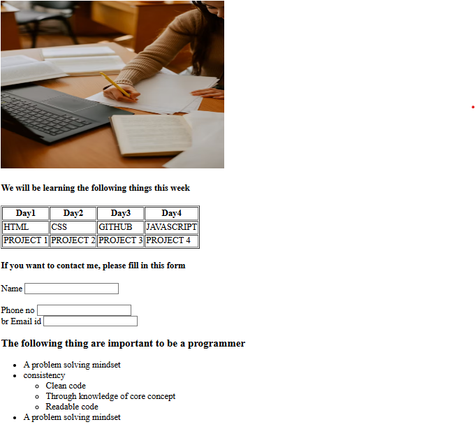

# 🧩 Project Overview

This is a simple HTML webpage demonstrating basic web development concepts such as:

- Using images

- Creating tables

- Building forms for user input

- Structuring content with headings and lists

[live at](https://nandakrishna1.github.io/02-form/)

## 📅 Weekly Learning Schedule

A table outlines what topics will be covered during the week:

## 📋 Contact Form

Users can fill out a simple contact form to reach you:

## 💡 Key Qualities of a Programmer

At the end, there’s a list of essential skills every programmer should have:

## ⚙️ Technologies Used

- HTML5

- Font Awesome (via CDN) for icons

- Unsplash for image content

## 🚀 How to View

- Save the code as index.html

- Open it in any web browser (Chrome, Edge, Firefox, etc.)

- You’ll see the structured page with image, table, form, and list content.

## 🧠 Learning Outcome

This simple project helps beginners practice:

- Structuring an HTML document

- Using tables and forms

- Organizing semantic content

- Debugging small syntax errors